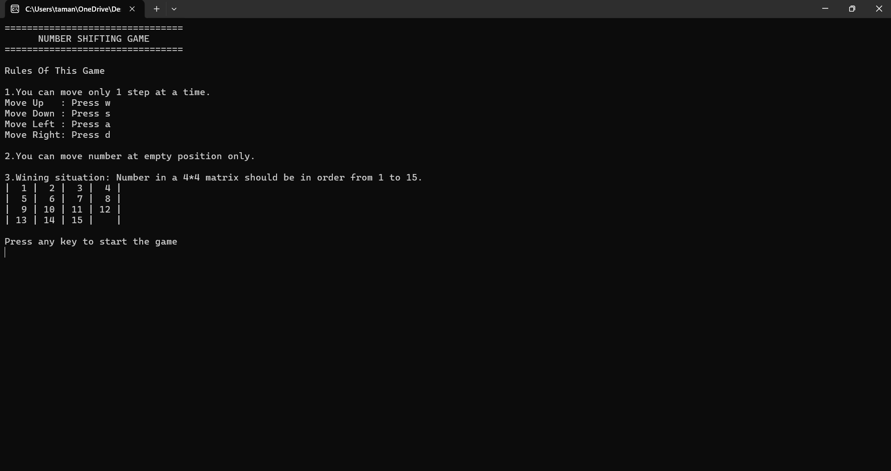
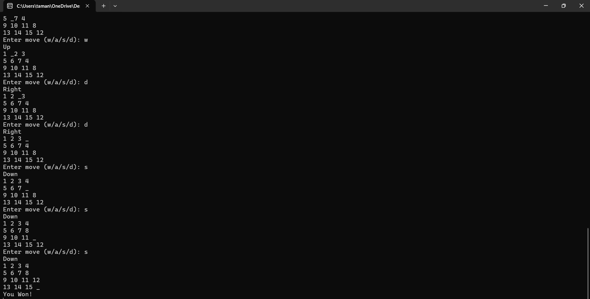

# Number Shifting Game

A simple 4×4 number shifting puzzle game built in C.

## About

This is a console-based implementation of the classic sliding puzzle game.

The board contains numbers from 1 to 15 and one empty space. The goal is to arrange all numbers in the correct order by moving tiles into the empty space.

## Controls

- W → Up
- A → Left
- S → Down
- D → Right

## Gameplay

### Start Screen


### Winning Screen


## Features

- 4×4 puzzle board
- Tile movement system
- Invalid move detection
- Win condition checking
- Console-based gameplay

## Technologies Used

- C Programming Language

## How to Run

### Prerequisites
- GCC Compiler (MinGW for Windows)
- Terminal / Command Prompt

### Steps

1. Clone this repository:

```bash
git clone https://github.com/your-username/Number-Shifting-Game.git
```

2. Navigate to the project directory:

```bash
cd Number-Shifting-Game
```

3. Compile the source code:

```bash
gcc main.c -o game
```

4. Run the executable:

**Windows**
```bash
game.exe
```

**Linux/macOS**
```bash
./game
```

5. Follow the on-screen instructions to play the game.

## What I Learned

- Arrays and matrices
- Functions
- Loops
- Conditional statements
- Problem solving in C

## Author

Tamanna
